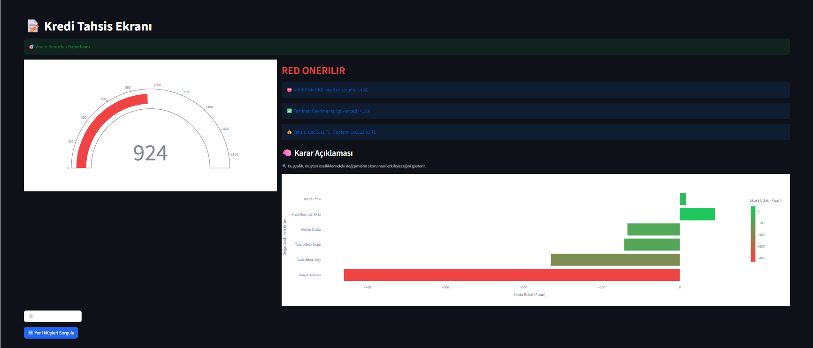
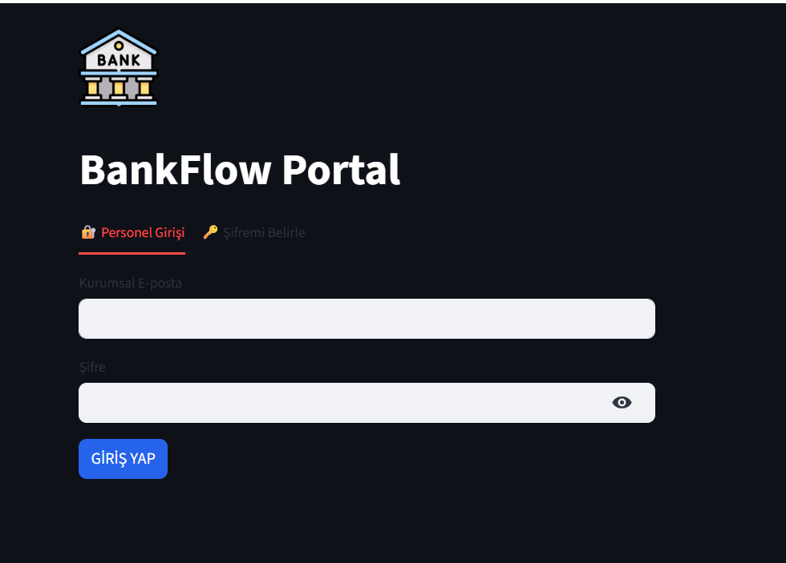
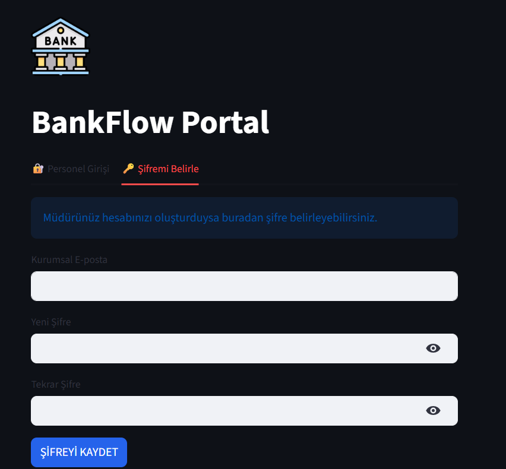
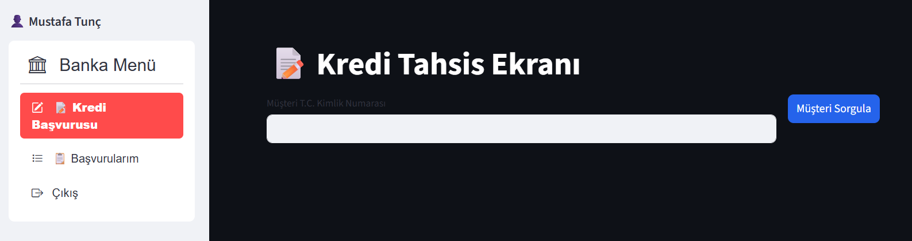
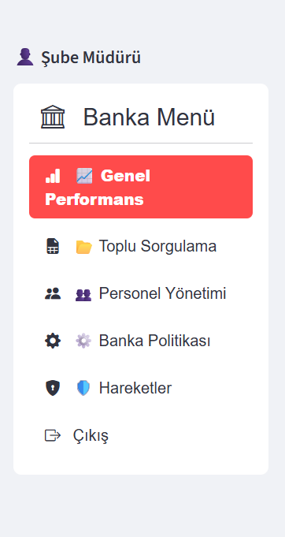

# 🏦 BankFlow | Yapay Zeka Destekli Kredi Risk Analiz Sistemi


**BankFlow**, bankacılık süreçlerinde kredi tahsis kararlarını hızlandırmak, güvenilirliği artırmak ve operasyonel verimliliği sağlamak amacıyla geliştirilmiş yeni nesil bir finansal teknoloji uygulamasıdır. 

Derin Öğrenme (Deep Learning) ve Kural Tabanlı (Rule-Based) algoritmaları birleştiren **hibrit karar motoru** sayesinde, saniyeler içinde risk skorlaması yapar ve kararın nedenlerini (XAI) açıklar.

---

## 📸 Proje Ekran Görüntüleri

### 1. Detaylı Risk Analizi ve XAI (Açıklanabilir Yapay Zeka)
Sistem sadece "Red" veya "Onay" kararı vermekle kalmaz; kararın arkasındaki matematiksel nedenleri analiz eder.


* **Risk Göstergesi:** 0-1900 arası puanlama ile görsel risk analizi.
* **Karar Destek:** Model sonucu ve banka politikalarına göre nihai karar önerisi.
* **Etki Analizi:** Yaş, gelir, vade gibi faktörlerin skoru ne kadar etkilediğini gösteren XAI grafiği.

### 2. Güvenli Giriş ve Kullanıcı Yönetimi
**Role-Based Access Control (RBAC)** mimarisi ile Şube Müdürü ve Personel için ayrıştırılmış arayüzler.

| Giriş Ekranı | Şifre Belirleme |
| :---: | :---: |
|  |  |
| *Kurumsal e-posta ile güvenli giriş.* | *Yöneticinin yetkilendirdiği personeller için şifre belirleme.* |

### 3. Kullanıcı Dostu Arayüzler

| Personel Paneli | Yönetici (Admin) Paneli |
| :---: | :---: |
|  |  |
| *Sadeleştirilmiş kredi başvuru ekranı.* | *Şube performansı, toplu sorgu ve ayarlar.* |

---

## 🚀 Temel Özellikler

* **🧠 Hibrit Karar Motoru:** TensorFlow (Neural Network) ve Bankacılık iş kurallarının (Business Rules) birleşimi.
* **🔍 Açıklanabilir Yapay Zeka (XAI):** Müşterinin neden reddedildiğini veya onaylandığını şeffaf bir şekilde açıklar.
* **📄 Otomatik Raporlama:** Analiz sonuçlarını anında kurumsal formatta PDF olarak indirilebilir.
* **📂 Toplu İşlem (Batch Processing):** Excel listesi yükleyerek binlerce müşteriyi aynı anda analiz etme yeteneği.
* **📊 Yönetim Paneli:** Şube ve personel bazlı ciro, onay oranı ve performans grafikleri (Plotly).
* **🛡️ Yüksek Güvenlik:** `bcrypt` ile şifreleme, SQL Injection korumalı veritabanı yapısı ve güvenli oturum yönetimi.

---

## 🛠️ Kullanılan Teknolojiler

* **Programlama Dili:** Python 3.x
* **Arayüz (UI):** Streamlit
* **Yapay Zeka & ML:** TensorFlow, Keras, Scikit-Learn
* **Veri İşleme:** Pandas, NumPy
* **Görselleştirme:** Plotly, Matplotlib
* **Veritabanı:** SQLite3

---

## ⚙️ Kurulum ve Çalıştırma

Projeyi yerel makinenizde çalıştırmak için aşağıdaki adımları izleyin:

### 1. Repoyu Klonlayın
```bash
git clone https://github.com/mustafaatunc/BankFlow.git
cd BankFlow
```

### 2. Gerekli Kütüphaneleri Yükleyin
```bash
pip install -r requirements.txt
```

### 3. Yönetici Şifresini Belirleyin (Güvenlik)
Ana dizine `.env` adında bir dosya oluşturun ve içine yönetici girişi için kullanmak istediğiniz şifreyi yazın:

```text
ADMIN_PASSWORD=GucluBirSifre123
```

### 4. Modeli Eğitin
Uygulamayı ilk kez başlatmadan önce yapay zeka modelini eğitmeniz ve `pkl` dosyalarını oluşturmanız gerekir:

```bash
python main.py
```

### 5. Uygulamayı Başlatın
```bash
python -m streamlit run app.py
```

---

## 👤 Giriş Bilgileri

Uygulama başladığında varsayılan yönetici hesabı ile giriş yapabilirsiniz:

* **E-posta:** `admin@admin.com`
* **Şifre:** `.env` dosyasına yazdığınız şifre.

---


