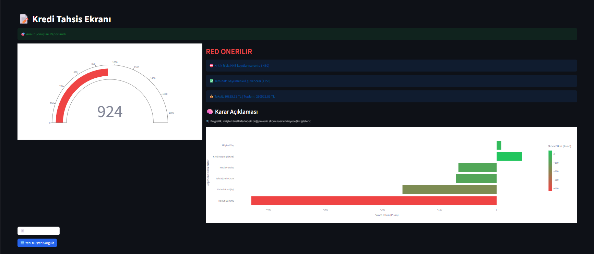
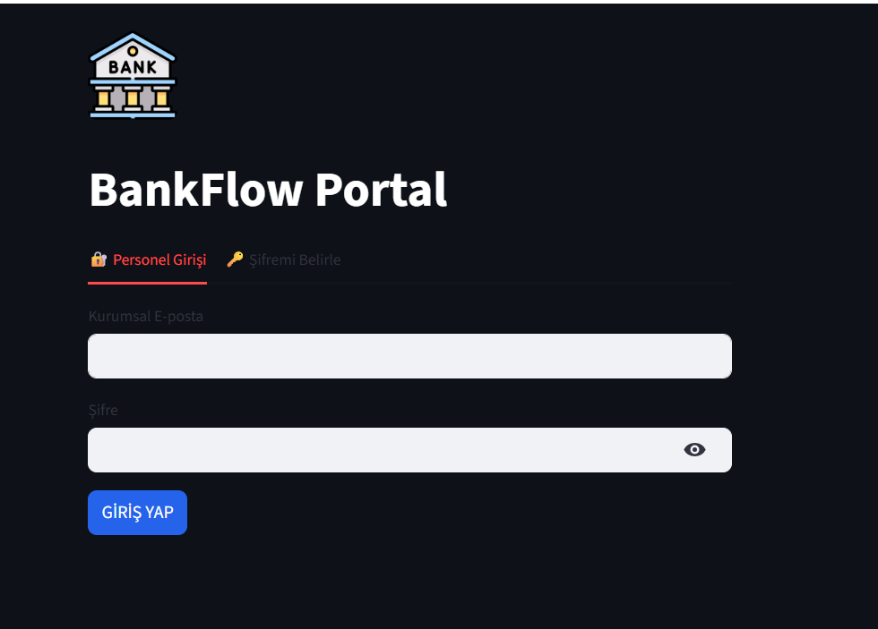
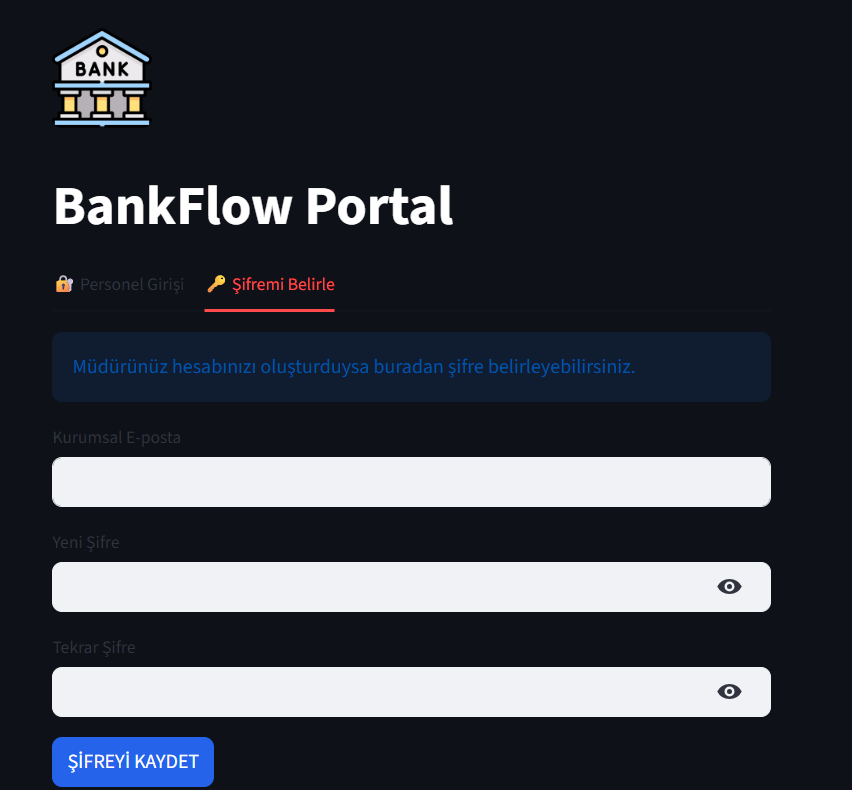
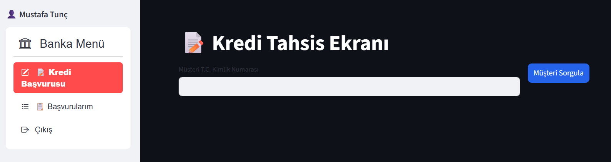
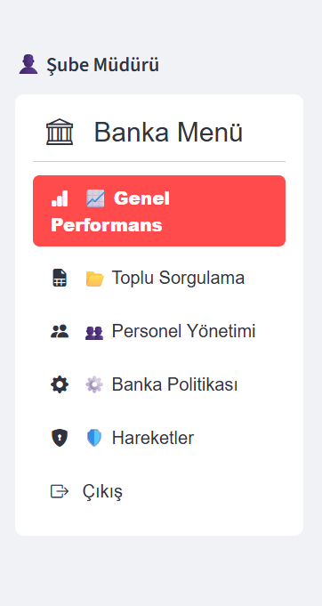

# 🏦 BankFlow | AI-Powered Credit Risk Analysis System


**BankFlow** is a next-generation financial technology application developed to accelerate credit allocation decisions, increase reliability, and ensure operational efficiency in banking processes. 

Thanks to its **hybrid decision engine** that combines Deep Learning and Rule-Based algorithms, it performs risk scoring in seconds and explains the reasons for the decision (XAI).

---

## 📸 Project Screenshots

### 1. Detailed Risk Analysis and XAI (Explainable AI)
The system doesn't just make a "Reject" or "Approve" decision; it analyzes the mathematical reasons behind the decision.


* **Risk Indicator:** Visual risk analysis with scoring between 0-1900.
* **Decision Support:** Final decision recommendation based on model results and bank policies.
* **Impact Analysis:** XAI graph showing how factors like age, income, and maturity affect the score.

### 2. Secure Login and User Management
Separated interfaces for Branch Manager and Staff with **Role-Based Access Control (RBAC)** architecture.

| Login Screen | Password Setup |
| :---: | :---: |
|  |  |
| *Secure login with corporate email.* | *Password setup for staff authorized by the manager.* |

### 3. User-Friendly Interfaces

| Staff Panel | Manager (Admin) Panel |
| :---: | :---: |
|  |  |
| *Simplified credit application screen.* | *Branch performance, batch query, and settings.* |

---

## 🚀 Key Features

* **🧠 Hybrid Decision Engine:** Combination of TensorFlow (Neural Network) and Banking business rules.
* **🔍 Explainable AI (XAI):** Transparently explains why the customer was rejected or approved.
* **📄 Automated Reporting:** Analysis results can be instantly downloaded as a PDF in corporate format.
* **📂 Batch Processing:** Ability to analyze thousands of customers simultaneously by uploading an Excel list.
* **📊 Management Panel:** Branch and staff-based turnover, approval rate, and performance charts (Plotly).
* **🛡️ High Security:** Encryption with `bcrypt`, SQL Injection protected database structure, and secure session management.

---

## 🛠️ Technologies Used

* **Programming Language:** Python 3.x
* **Interface (UI):** Streamlit
* **AI & ML:** TensorFlow, Keras, Scikit-Learn
* **Data Processing:** Pandas, NumPy
* **Visualization:** Plotly, Matplotlib
* **Database:** SQLite3

---

## ⚙️ Installation and Execution

Follow the steps below to run the project on your local machine:

### 1. Clone the Repository
```bash
git clone [https://github.com/mustafaatunc/BankFlow.git](https://github.com/mustafaatunc/BankFlow.git)
cd BankFlow
```

### 2. Install Required Libraries
```bash
pip install -r requirements.txt
```

### 3. Set the Admin Password (Security)
Create a file named `.env` in the root directory and write the password you want to use for admin login inside it:

```text
ADMIN_PASSWORD=StrongPassword123
```

### 4. Train the Model
Before launching the application for the first time, you need to train the AI model and generate the `pkl` files:

```bash
python main.py
```

### 5. Launch the Application
```bash
python -m streamlit run app.py
```

---

## 👤 Login Credentials

When the application starts, you can log in with the default admin account:

* **Email:** `admin@admin.com`
* **Password:** The password you wrote in the `.env` file.

---
